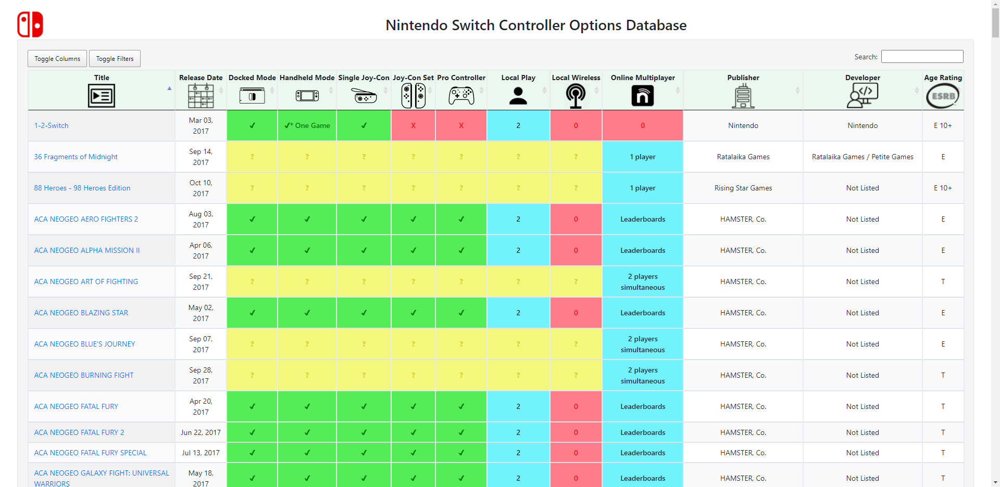

# Nintendo-Switch-Controller-DB

# [Live Site](https://xmoose25x.github.io/Nintendo-Switch-Controller-DB/)

Retired Web Scraper that generated a list of all Nintendo Switch games and their respective controller configurations.

The website is made using [Bootstrap](https://getbootstrap.com/) and [DataTables](https://datatables.net/) and currently showcases the state of the site when it was decommissioned on **8/7/2017**.

It used [PhantomJS](https://phantomjs.org/) to automate the process of finding every video game on [Nintendo's website](https://www.nintendo.com/) and extracting the information about the type of controllers that are supported.

All missing data was crowd-sourced via [Reddit](https://www.reddit.com/r/NintendoSwitch/) using [Google App Scripts](https://www.google.com/script/start/).

# Copyright / Attribution Notices
Icons were from © Noun Project Inc. and have not been altered via their [Creative Commons agreement](https://thenounproject.com/legal/).
All games and material are copyright of Nintendo Co., Ltd. and are used solely for helping others find and appreciate the software being developed!